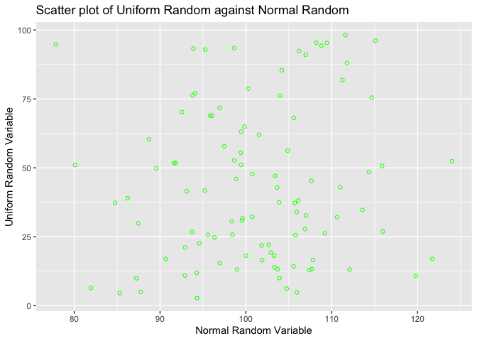

## Import Libraries


```r
library(tidyverse)
```

```
## ── Attaching packages ─────────────────────────────────────── tidyverse 1.3.1 ──
```

```
## ✓ ggplot2 3.3.5     ✓ purrr   0.3.4
## ✓ tibble  3.1.3     ✓ dplyr   1.0.7
## ✓ tidyr   1.1.3     ✓ stringr 1.4.0
## ✓ readr   2.0.0     ✓ forcats 0.5.1
```

```
## ── Conflicts ────────────────────────────────────────── tidyverse_conflicts() ──
## x dplyr::filter() masks stats::filter()
## x dplyr::lag()    masks stats::lag()
```


## Import and summarize data


```r
data = read_csv('/Users/anisha/Dropbox/My Mac (Anishas-MacBook-Air.local)/Desktop/R_Markdown_Script/data/data.csv')
```

```
## Rows: 100 Columns: 2
```

```
## ── Column specification ────────────────────────────────────────────────────────
## Delimiter: ","
## dbl (2): x, y
```

```
## 
## ℹ Use `spec()` to retrieve the full column specification for this data.
## ℹ Specify the column types or set `show_col_types = FALSE` to quiet this message.
```

```r
head(data)
```

```
## # A tibble: 6 × 2
##       x     y
##   <dbl> <dbl>
## 1  93.7  26.8
## 2 102.   21.9
## 3  91.6  51.7
## 4 116.   26.9
## 5 103.   18.1
## 6  91.8  51.9
```


```r
summary(data)
```

```
##        x                y         
##  Min.   : 77.85   Min.   : 2.779  
##  1st Qu.: 95.06   1st Qu.:18.947  
##  Median :101.14   Median :37.810  
##  Mean   :101.09   Mean   :43.502  
##  3rd Qu.:106.92   3rd Qu.:63.596  
##  Max.   :124.02   Max.   :98.156
```


Scatter plot of y against x.


```r
data %>% ggplot(aes(x = x, y = y)) +
  geom_point(colour = 'green', shape = 1) +
  labs(x = 'Normal Random Variable', y = 'Uniform Random Variable',
       title = 'Scatter plot of Uniform Random against Normal Random')
```

<!-- -->


Regress Uniform random variable 'y' on Normal random variable.


```r
reg_basic = lm(y ~ x, data = data )
summary(reg_basic)
```

```
## 
## Call:
## lm(formula = y ~ x, data = data)
## 
## Residuals:
##     Min      1Q  Median      3Q     Max 
## -39.958 -24.095  -4.863  20.490  57.297 
## 
## Coefficients:
##             Estimate Std. Error t value Pr(>|t|)
## (Intercept)  17.3921    31.7033   0.549    0.585
## x             0.2583     0.3124   0.827    0.410
## 
## Residual standard error: 27.92 on 98 degrees of freedom
## Multiple R-squared:  0.006927,	Adjusted R-squared:  -0.003207 
## F-statistic: 0.6835 on 1 and 98 DF,  p-value: 0.4104
```


